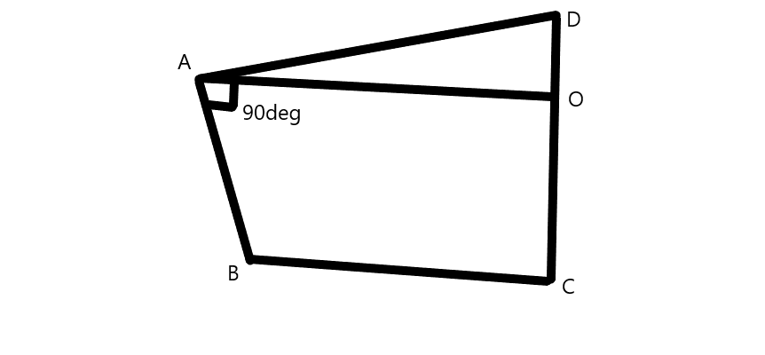

# Algorithm Explanation

This document provides a brief explanation of the algorithm, which may have already been implemented or needs to be implemented in the project. Developers working on this project can refer to this file. If you're curious about the background, feel free to take a peek...

## Phrases or Words to Note:
- `coords`: co-ordinates
- `interval_time`: the interval at which a keyframe has to be animated
- `tracked_coords`: tracked co-ordinates transferred from .py to .cpp
- `MP`: MediaPipe
- `initial_base_bone_pos`: the position of the base bone of the current frame
- `initail_child_bone_pos`: the position of the child bone of the current frame
- `final_base_bone_pos`: the position of the base bone of the next frame
- `final_child_bone_pos`: the position of the child bone of the next frame

After getting `coords` from .py to .cpp, the following steps are taken:


## Getting the `interval_time`

Calculate the total time of the video using total frames and frames per second (fps):

```python
total_time = total_frames / fps
```

Then we can easily find the interval_time by dividing 1 by fps.

```python
interval_time = 1 / fps
```


## Convert the `tracked_coords` to 3D scale

The `tracked_coords` values are clamped to the range of (-2, 2), implying a different unit/scale. Convert these points to a 3D scale (Assumption: `tracked_coords` scale/unit = 10):

```python
tracked_coords = tracked_coords * scale/unit
```

These coordinates can then be transferred to calculate the origin.


## Adjust the `tracked_coords` according to the origin

The tracked_coords from MP all have the midpoint of bone index [23] and [24] which is [left_hip] and [right_hip] respectively. But in the 3D world, the origin will be from the world origin. So we can convert the tracked_coords to the 3D world coords by taking the WorldCordinates of the [hip_bone] (the bone from imported 3D model which is assigned as the index of hip_bone position which is mapped by the user manually) and adding it with the tracked_coords.

```python
tracked_coords = tracked_coords + WorldCordinate( [hip_bone] )
```

Now, `tracked_coords` represent 3D world coordinates with the origin.


## Finding the relation between `tracked_coords`

As tracked_coords only contain translation values, find the rotation of each bone in the 3D world using these translation values from MediaPipe Pose Estimation. Moreover the MP Pose Estimation uses different structure to track co-ordinates as shown below.


We have to find the rotation value of each bone by using this pose structure in .cpp.  


##  Calculating the Rotation

When calculating the rotation of the child bone, the parent bone may not be stationary, it can also move making the whole movement graph a quadilateral. So to actually find the roation of the child bone. We can take the `final_base_bone_pos`, `final_child_bone_pos` and the 



To find the rotation matrix that transforms vector B to vector A while keeping vector D fixed (i.e., a rotation from B to A about the axis defined by vector D), you can follow these steps:

Find the rotation axis:
The rotation axis can be found by taking the cross product of vectors D and B.

```python
Axis=normalize(cross(D,B))Axis=normalize(cross(D,B))
```

Find the rotation angle:
The rotation angle can be found using the dot product and the magnitudes of vectors D and B.

```python
    cos⁡(θ)=dot(D,B)∥D∥⋅∥B∥cos(θ)=∥D∥⋅∥B∥dot(D,B)​
    sin⁡(θ)=1−cos⁡2(θ)sin(θ)=1−cos2(θ)
```​

Create the rotation matrix:
Use the axis-angle representation to create the rotation matrix. The rotation matrix RR is given by:

```python
    R=I+sin⁡(θ)K+(1−cos⁡(θ))K2R=I+sin(θ)K+(1−cos(θ))K2
```

where KK is the skew-symmetric matrix of the rotation axis.

Now, let's perform the calculations:

```python
Axis=normalize(cross(D,B))Axis=normalize(cross(D,B))

cos⁡(θ)=dot(D,B)∥D∥⋅∥B∥cos(θ)=∥D∥⋅∥B∥dot(D,B)​

sin⁡(θ)=1−cos⁡2(θ)sin(θ)=1−cos2(θ)
```

Finally, construct the rotation matrix RR using the axis-angle representation.

Keep in mind that the rotation matrix might be a 3x3 matrix, and you can use it to rotate vector B to match vector A while keeping vector D fixed.