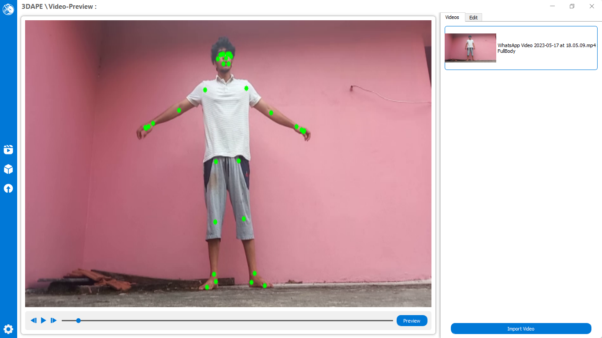
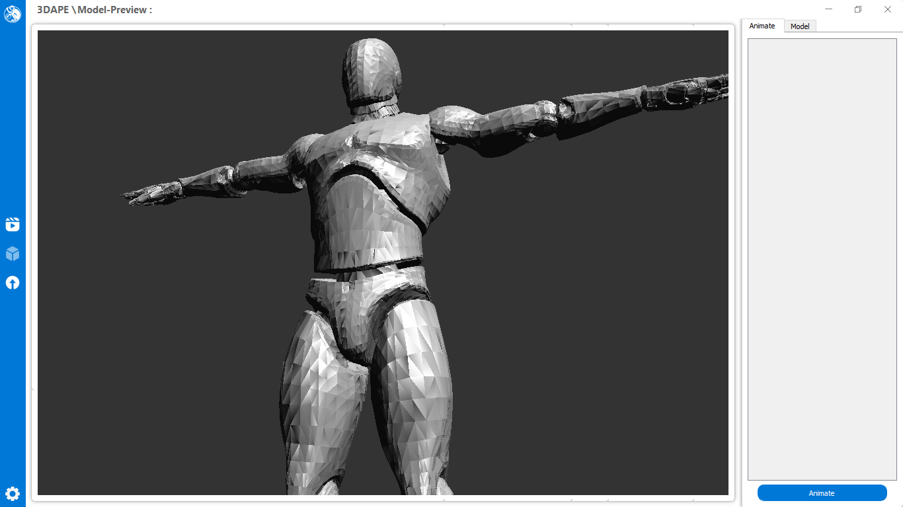

<h1 align="center">
  
</h1> 

3DAPE is a powerful and efficient tool designed for tracking human poses from multiple video files and exporting them in the FBX file format. It is aimed at animators, game developers, and virtual reality creators, providing an automated solution to create realistic human movements and animations, thus saving time and effort in the development process.

<h3>Usage</h3>

• Import Video Files: Launch the software and use the import feature to load video files for pose tracking.

• Adjust Tracking Parameters: Fine-tune tracking settings such as pose accuracy, synchronization options, and frame rate to get the best results for your specific project.

• Track Poses: The software uses advanced pose estimation models to detect and track human poses in each frame of the video.

• Export to FBX: Once the tracking process is complete, export the poses and animations in FBX format for further use in animation, game development, or VR applications.

 
<h3>Pose Estimation:</h3>
 

<h3>Model Renderer:</h3>
 